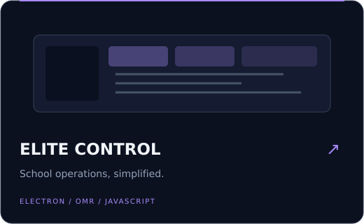
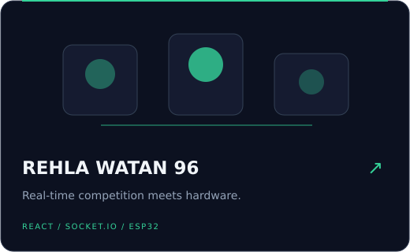
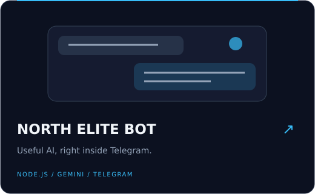
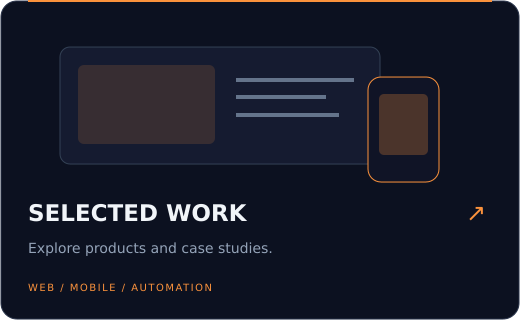

&nbsp;

### من فكرة… إلى تجربة تستحق الاستخدام.

أنا **مصطفى أحمد**. أبني مواقع وتطبيقات وأنظمة تساعد الناس على إنجاز شغلهم بسهولة، وأصمّم تجارب عربية تجمع بين الشكل الجذاب والوظيفة العملية.

**تطبيقات Flutter · أنظمة ويب وسطح مكتب · أتمتة وذكاء اصطناعي · تجارب تفاعلية**

Based in Rafha, Saudi Arabia · Building for real-world workflows

 

## Selected work
A few things I've built — click a card to explore.

<table>
<tr>
<td width="50%"></td>
<td width="50%"></td>
</tr>
<tr>
<td width="50%"></td>
<td width="50%"></td>
</tr>
</table>

 

## My toolkit

 

 

 

## ماذا أقدر أبني لك؟

🌐 **مواقع وأنظمة مخصصة** — بوابات، لوحات تحكم، وأدوات لتنظيم العمل.

📱 **تطبيقات موبايل وسطح مكتب** — حلول Flutter وElectron حسب احتياجك.

⚡ **أتمتة وتكاملات ذكية** — تقليل المهام المتكررة وربط أدواتك ببعض.

🎮 **تجارب تفاعلية** — مسابقات، ألعاب تعليمية، وتفاعل مباشر مع الأجهزة.

---

<strong>Have an idea? Let's make it work.</strong>  
<a href="https://mostafa-portfolio-ashen.vercel.app/">View portfolio</a>
&nbsp; • &nbsp;
<a href="mailto:moahmed7412@gmail.com">Get in touch</a>

