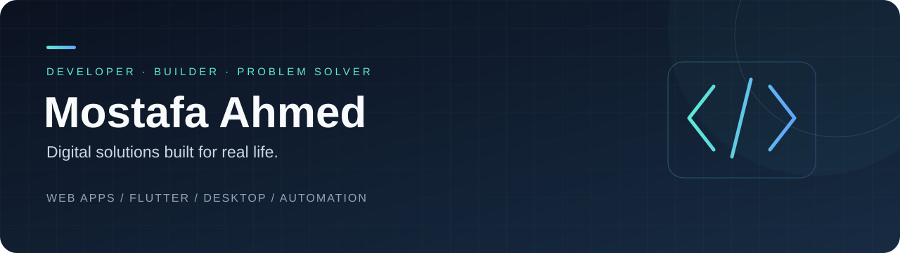

  

  <a href="https://mostafa-portfolio-ashen.vercel.app/"><strong>Explore my work ↗</strong></a>
  &nbsp; · &nbsp;
  <a href="mailto:moahmed7412@gmail.com"><strong>Let's build something ↗</strong></a>

## أهلًا، أنا مصطفى أحمد

أطوّر مواقع وتطبيقات وأنظمة مخصصة تحوّل الأفكار إلى أدوات مفيدة في العمل اليومي. أعمل على حلول للمدارس والأنشطة التجارية، من لوحات الإدارة وتطبيقات Flutter إلى الأتمتة والتجارب التفاعلية.

**أهتم بأن يكون المنتج واضحًا، عمليًا، وسهل الاستخدام — مع تجربة عربية مصممة من البداية.**

### From an idea to a working product

I build custom web, mobile, and desktop applications, with a focus on practical workflows, Arabic interfaces, and useful integrations. My work spans education, business tools, automation, and interactive experiences.

---

### What I build

| Focus | Solutions |
| :--- | :--- |
| **Web & business tools** | Custom websites, dashboards, portals, and operational systems |
| **Mobile & desktop** | Flutter applications and Electron desktop tools |
| **Education** | School workflows, student services, assessment, and learning experiences |
| **Automation & AI** | Telegram bots, AI integrations, and connected workflows |
| **Interactive experiences** | Live competitions, real-time interfaces, and hardware-connected activities |

### Selected projects

<table>
<tr>
<td width="50%" valign="top">

#### 01 / School operations
**[Elite Control](https://github.com/MostafaAhmed71/elite-control-electron)**

A desktop toolkit bringing OMR grading, graduation invitations, and student services together.

Electron · JavaScript · Vite · OMR

</td>
<td width="50%" valign="top">

#### 02 / Live interactive experiences
**[Rehla Watan 96 · رحلة وطن](https://github.com/MostafaAhmed71/rehla-watan-96)**

A live school competition with dedicated team and display interfaces, connected to ESP32 buzzers.

React · Node.js · Socket.IO · ESP32

</td>
</tr>
<tr>
<td width="50%" valign="top">

#### 03 / AI & automation
**[North Elite Telegram Bot](https://github.com/MostafaAhmed71/nokbat-telegram-bot)**

Student and teacher services, quizzes, AI assistance, and administrative workflows inside Telegram.

Node.js · Telegraf · Gemini · Supabase

</td>
<td width="50%" valign="top">

#### 04 / Portfolio
**[My work & case studies](https://mostafa-portfolio-ashen.vercel.app/)**

Explore the web, mobile, desktop, and automation solutions I build for schools and businesses.

[View source →](https://github.com/MostafaAhmed71/mostafa-portfolio)

Web · Mobile · Desktop · Automation

</td>
</tr>
</table>

### Tools I work with

**Interfaces**  
Flutter & Dart · React · TypeScript · Next.js · HTML & CSS

**Backend & data**  
Node.js · Express · Python · PHP · PostgreSQL · Supabase · Firebase · SQLite

**Delivery & integrations**  
Git & GitHub · Vite · Electron · Vercel · Telegram bots · AI APIs · ESP32

---

### عندك فكرة أو شغل محتاج تنظيم؟

موقع، تطبيق، نظام إدارة، أو أتمتة لمهمة متكررة — تواصل معي لنحدد احتياجك ونحوّله إلى حل قابل للاستخدام.

  <a href="https://mostafa-portfolio-ashen.vercel.app/"><strong>Portfolio / الأعمال</strong></a>
  &nbsp; · &nbsp;
  <a href="mailto:moahmed7412@gmail.com"><strong>Email / تواصل معي</strong></a>

